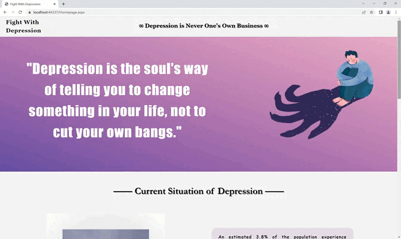

The website is designed for common people who think they may trap in depression to have a professional PHQ-test for them to know which degree they are at for depression.  
网站是为了一些觉得自己可能得抑郁的人设计的，让他们有机会可以有一个比较专业的PHQ测试来评估自己抑郁的程度。   

Meanwhile, a form is used to collect information from patients who may need help, where the background is meteor streaking and decorated with StellaLou, hoping to bringing more comfort for patients.   
表单用于收集可能会需要帮助的病人的信息，背景是流星划过，搭配着星黛露希望能给病人带来更多安抚。  

